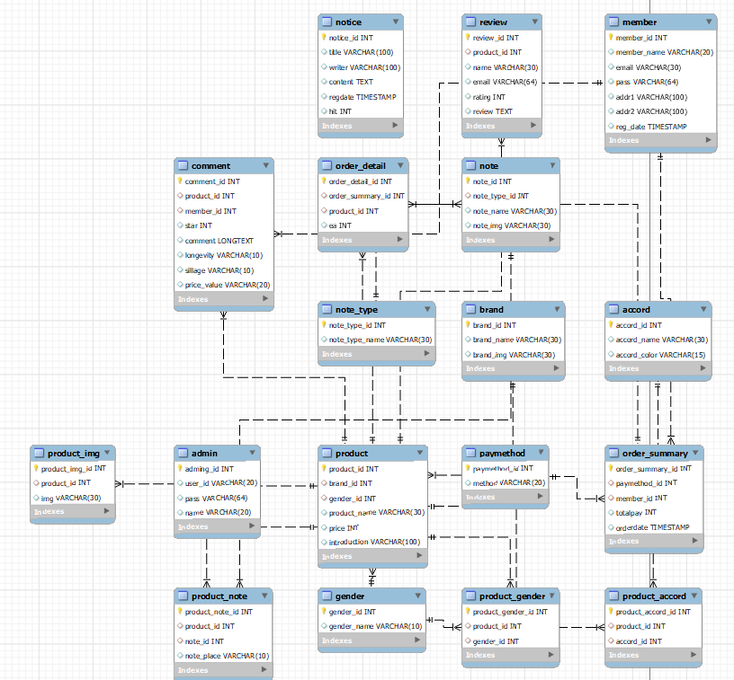
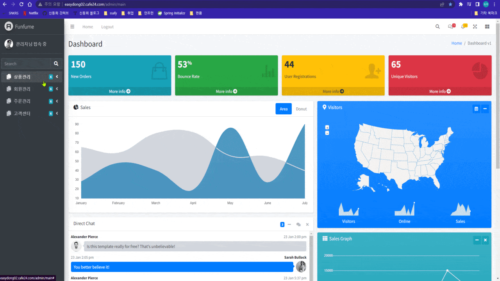
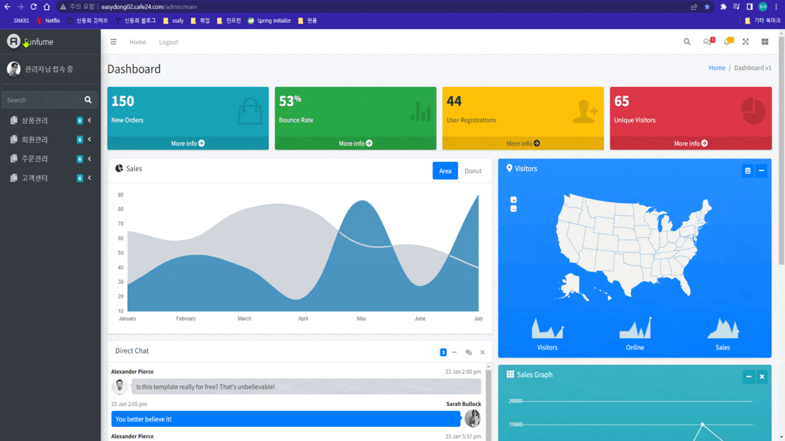

# Funfume 프로젝트

🐱 본 프로젝트는 **국비교육 백엔드** 파이널 프로젝트입니다.

## 목차

## 개요

- 다양한 카테고리의 향수 판매 쇼핑몰을 Business logic과 User Interface를 분리하여 개발하는 것에 중점.

## 프로젝트 기간

- 2021년 12월 29일 ~ 2022년 1월 13일

## 기술 스택

   
   
   
   
   
   
  

## 팀원

<table>
  <thead>
    <tr>
      <th>이름</th>
      <th>역할</th>
      <th>구현 기능</th>
    </tr>
  </thead>
  <tbody>
    <tr>
      <td rowspan="2">신동희</td>
      <td rowspan="2">팀장</td>
      <td>Back-End (향수 등록, 파일 업로드, 회원, 구매 로직 등 REST API 설계) </td>
    </tr>
    <tr>
      <td>Front-End (사용자 페이지, 관리자 페이지 및 파일 드래그 앤 드랍 방식 등 전반)</td>
    </tr>
    <tr>
      <td rowspan="2">김정철</td>
      <td rowspan="2">팀원</td>
      <td>Back-End (관리자 페이지 노트, 노특 세부 타입 등록 관리 로직) </td>
    </tr>
    <tr>
      <td>Front-End (회원 정보 수정 등 전반)</td>
    </tr>
    <tr>
      <td rowspan="2">임나현</td>
      <td rowspan="2">팀원</td>
      <td>Back-End (관리자 페이지 향 등록 관리 로직) </td>
    </tr>
    <tr>
      <td>Front-End (about us)</td>
    </tr>
    <tr>
      <td rowspan="2">정종빈</td>
      <td rowspan="2">팀원</td>
      <td>Back-End (관리자 페이지 브랜드 관리 등록 로직) </td>
    </tr>
    <tr>
      <td>Front-End (공지사항)</td>
    </tr>
  </tbody>
</table>

## DataBase 설계

## 주요기능

| Depth1          | Depth2               | 내용                                                                                                                                                                                                                                                                                                                                                                                                                                                                                                                                                                                                       |
| --------------- | -------------------- | ---------------------------------------------------------------------------------------------------------------------------------------------------------------------------------------------------------------------------------------------------------------------------------------------------------------------------------------------------------------------------------------------------------------------------------------------------------------------------------------------------------------------------------------------------------------------------------------------------------- |
| 로그인/회원관리 | 회원가입             | - 비밀번호, 이름,주소, 이메일 주소  - 카카오 API로 주소 입력   - 이메일 중복 검사   - 가입 클릭 시 로그인 페이지로 이동 |
| 로그인/회원관리 | 로그인               | - 아이디, 비밀번호 입력   - 로그인 완료 시 메인 페이지로 이동|
| 로그인/회원관리 | 로그아웃        | -로그아웃시 세션에서 삭제|
| 마이 페이지  | 회원 정보 수정             | - 비밀번호 변경  - 주소 변경|
| 마이 페이지     | 회원 탈퇴            | - 회원 정보의 비밀번호를 입력 후 일치 시 회원 탈퇴  - 탈퇴 시 db데이터는 삭제  - 탈퇴 시 메인 페이지로 이동|
| Shop     | 향수 구매         | - 수량을 정하고 결제  - 결제 방식선택 후 결제 진행    - 향수를 성별, 카테고리 등으로 분류하여 볼 수 있다.   - 관리자가 올린 사진들을 조회 할 수 있다.   - 향수의 정보들을 탭의 방식으로 볼 수 있다.|
| Shop   | 리뷰 등록                 | - 별점, 리뷰, 이메일 입력 후  리뷰 등록   |
| Shop   | 주문 목록 조회     | - 자신이 주문한 주문 목록을 볼 수 있다. 가격, 결제 방식, 향수 이미지, 향수 정보 등.  |
| Shop   | 공지사항 조회      | - 관리자가 올린 공지사항을 조회만 할 수 있다.  - 페이징 처리로 조회가 가능하다.|
| Shop   | About us | - 개발자들의 정보를 볼 수 있다.|
| 관리자       | 브랜드 관리        | - 브랜드를 사진과 함께 등록, 수정, 삭제가 가능하다.|
| 관리자        | 노트 관리      | - 노트를 대분류, 소분류로 나누어서 사진과 함께 등록, 수정, 삭제할 수 있다.|
| 관리자        | 향 관리        | - 향기를 등록하고 RGB 컬러를 입력하여 사용자가 어느 정도 예상할 수 있도록 할 수 있다.|
| 관리자        | 향수 관리        | - 위에서 등록한 브랜드, 노트, 향기를 향수 등록 폼에서 조회 할 수 있다.   - 향수 정보와 향수 성별 등을 입력 할 수 있다.   - 이미지들을 복수로 업로드 할 수 있으며, 드래그 앤 드랍 방식으로 편하게 등록, 삭제할 수 있다. |
| 관리자        | 공지사항 관리        | - 일반 회원이 아닌 관리자만 삭제할 수 있다.  - 게시글을 삭제 버튼을 누를 시 삭제  - 삭제 완료 시 공지사항 리스트로 이동|
| 관리자        | 회원 관리      | - 일반 회원이 아닌 관리자만 삭제할 수 있다.  - 회원 삭제 버튼을 누를 시 삭제  - 삭제 완료 시 공지사항 리스트로 이동||
| 관리자        | 주문내역 관리   | - 일반 회원이 아닌 관리자만 할 수 있다.|

## 실행 화면

**✅ (사용자)회원가입**

**✅ (사용자)회원수정 및 확인**

**✅ (사용자)향수구매**

**✅ (사용자)향수 리뷰 등록**

**✅ (사용자)주문 조회**

**✅ (관리자)브랜드 등록**

**✅ (관리자)노트 등록**

**✅ (관리자)향기 등록**

**✅ (관리자)향수 등록**

**✅ (관리자)주문 관리**

**✅ (관리자)회원 관리**

**✅ (관리자)공지사항 관리**

